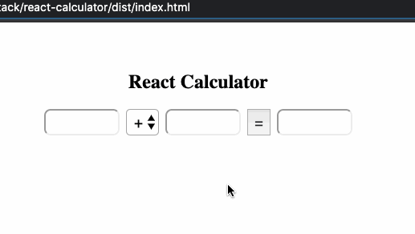

# React Calculator

## Instructions

Use create-react-app as you did in class to replace the content of this folder.

Open <https://github.com/SummerOfCode2020/week-11-homework-react-math-calc>

NOTE!:
You will need to delete the `page.gif` file in this folder once you read instructions.

Use the github repo linked above for a source of instructions after you destroy this local gif.

The deletion is needed for the create-react-app command to create all files in this folder.

Cd to your main parent folder first to do this so it adds content to this folder.

From the parent folder, run `npx create-react-app week-11-homework-react-math-calc` and then create React components for a calculator that looks and works like the requirement we see in the attached image:

